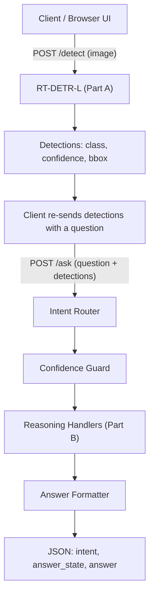
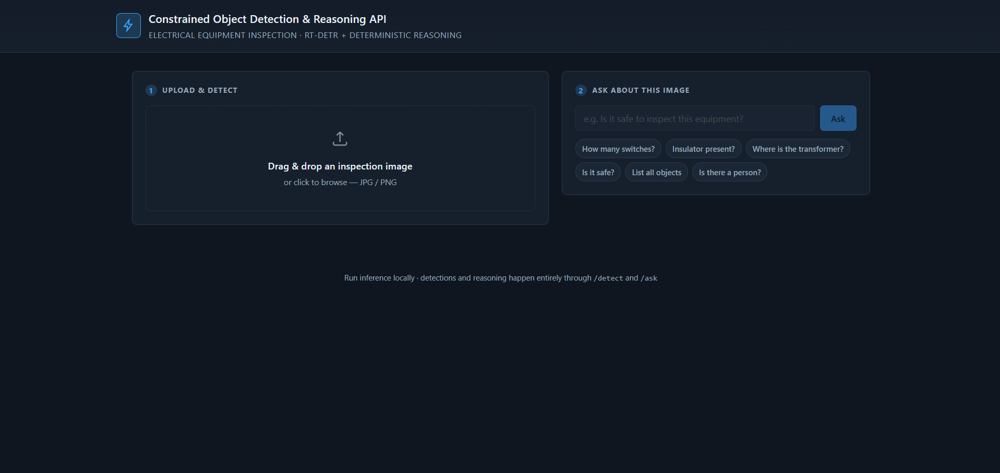
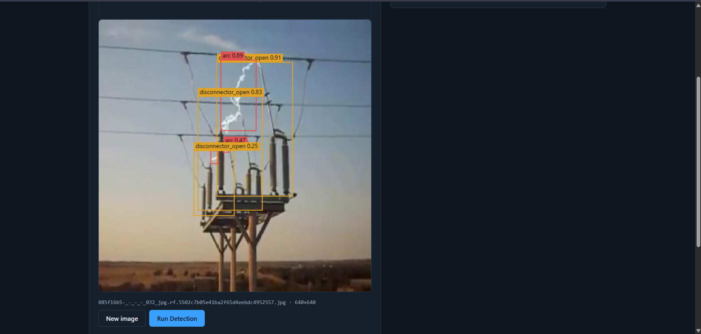
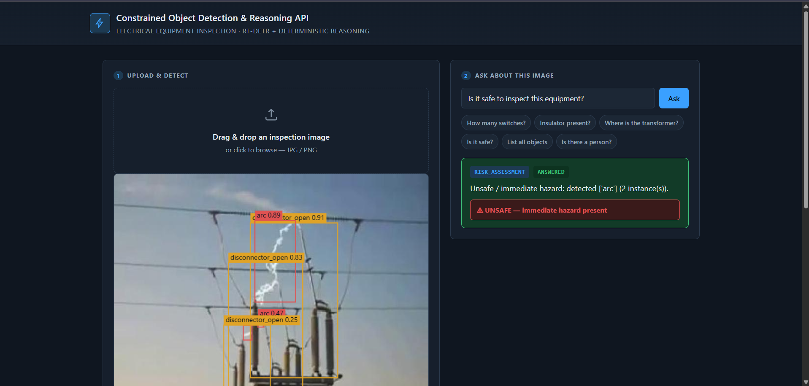
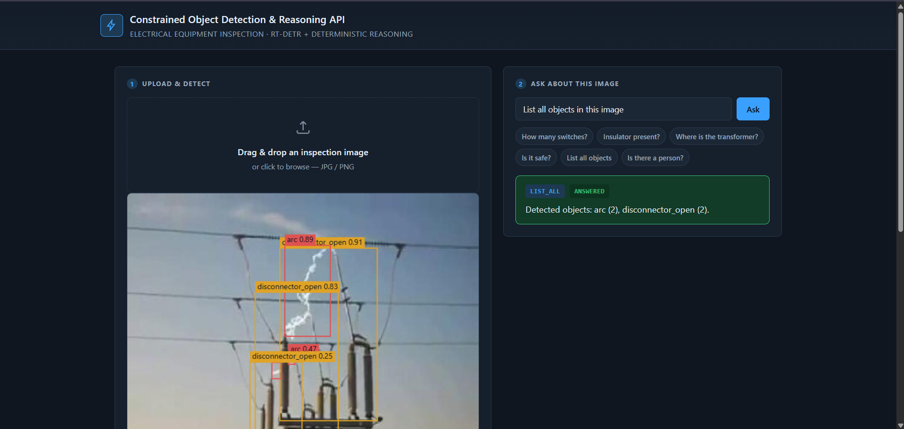
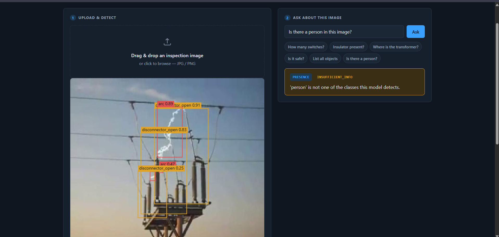

# Constrained Object Detection & Reasoning API

A FastAPI service for **electrical equipment inspection** that fine-tunes
RT-DETR to detect equipment/hazard classes in images (Part A), then answers
natural-language questions about what was detected through a deterministic,
hand-written reasoning layer (Part B) — no LLMs, no agentic frameworks
anywhere in the pipeline.

## What it does

1. **Detect** — upload an inspection image; RT-DETR-L returns bounding boxes,
   classes, and confidences for the 8 known equipment/hazard classes.
2. **Ask** — ask a plain-English question about that same image (count,
   presence, location, risk, or "list everything"); a rule-based reasoning
   layer answers from the detections, or explicitly says it can't when the
   evidence isn't there.

### Part A — RT-DETR object detection

RT-DETR-L (Ultralytics), fine-tuned on a custom, non-COCO taxonomy of
electrical equipment. Served via `POST /detect`. See **Model & training**
and **Evaluation metrics** below for how it was trained and how well it
performs.

### Part B — deterministic reasoning

A small, fully hand-written pipeline (regex-based intent routing → confidence
filtering → per-intent decision logic → plain-language formatting) that
answers questions over a `/detect` result. No ML model, no LLM, and no
agentic framework (LangChain/LangGraph/CrewAI/AutoGen, etc.) is used anywhere
in this layer — see **Reasoning behavior (Part B)** below.

## Supported classes

`arc`, `disconnector`, `disconnector_open`, `insulator`, `spark`, `switch`,
`switchgear`, `transformer` — 8 classes total, none of which are COCO
classes.

## Setup

```bash
pip install -r requirements.txt
uvicorn app.main:app --host 0.0.0.0 --port 8000
```

Requires `weights/best.pt` to be present (see **Model weights** below). Visit
`http://localhost:8000` for a browser UI (`app/static/index.html`), or call
the endpoints directly. See [QUICK_START.md](QUICK_START.md) for a condensed
version of these steps.

## Project structure

```
.
├── app/
│   ├── main.py                # FastAPI app: /health, /detect, /ask
│   ├── detector.py             # RT-DETR-L inference (Part A)
│   ├── static/index.html       # Browser UI (upload, detect, ask)
│   └── tests/                  # API-level tests
├── part_b/
│   ├── intent_router.py        # Regex-based question → intent + target class(es)
│   ├── confidence_guard.py     # Confidence filtering / hedging helpers
│   ├── reasoning.py            # Per-intent decision logic
│   ├── answer_formatter.py     # Structured result → plain-language answer
│   ├── pipeline.py             # Wires the above into answer_question()
│   ├── schema.py               # Shared types, class list, thresholds
│   └── tests/                  # Reasoning-layer unit tests
├── scripts/
│   ├── train_rtdetr.py         # Reproduces the RT-DETR-L training run
│   └── eval_rtdetr.py          # Reproduces the held-out test evaluation
├── notebooks/
│   └── RAP_RTDETR_Electrical_Inspection.ipynb  # Actual Kaggle training/eval run
├── docs/screenshots/            # UI screenshots (see below)
├── runs/detect/val/             # Evaluation plots (PR curves, confusion matrices)
├── weights/best.pt              # Trained RT-DETR-L checkpoint
├── convert_coco.py, integrity.py, audit.py, dataset_stats.py  # Dataset prep/validation
├── requirements.txt
├── Dockerfile / .dockerignore
├── QUICK_START.md
├── TECHNICAL_MEMO.pdf
└── README.md
```

## Architecture / system flow



## Dataset provenance

- Source: Roboflow project **"Station" v2** (workspace `ppe-detection-7kco8`,
  slug `station-raaga-ogkgf`), License **CC BY 4.0**.
- 9,718 images in the exported v2 COCO dataset, including augmentation-generated images (2025-09-23 export).
- Root COCO category `helmet-insulator` (id 0) is the project's unannotated
  supercategory and is intentionally excluded from training.
- **8 trained classes**: `arc`, `disconnector`, `disconnector_open`,
  `insulator`, `spark`, `switch`, `switchgear`, `transformer`.
- Pipeline: raw `train/`/`valid/`/`test/` (COCO) → `convert_coco.py` →
  `yolo_dataset/` (YOLO format + `data.yaml`), the format actually used for
  training. `yolo_dataset/data.yaml` uses a relative dataset root
  (`path: yolo_dataset`) and is portable across machines/clones.
- Validation scripts (run against the raw export before trusting a
  conversion):
  - `integrity.py` — cross-checks images on disk vs. COCO references,
    MD5-based duplicate/cross-split-leak detection.
  - `audit.py` — per-class annotation counts per split, flags invalid boxes.
  - `dataset_stats.py` — image dimension histograms, bbox size stats,
    unannotated-image counts.

## Model & training

- **RT-DETR-L**, fine-tuned via Ultralytics.
- Training config: `epochs=30, imgsz=640, batch=8, device=0, seed=0,
  deterministic=False, save_period=1`, run on Kaggle (after an earlier Colab
  run was interrupted by a GPU usage-limit disconnect at epoch 28/50).
- Training environment: **NVIDIA T4**, Python **3.12.13**, PyTorch
  **2.10.0+cu128**, Ultralytics **8.4.146**.
- Exact training wall-clock time was not recorded.
- The actual training/evaluation run is preserved in
  [`notebooks/RAP_RTDETR_Electrical_Inspection.ipynb`](notebooks/RAP_RTDETR_Electrical_Inspection.ipynb),
  and can be reproduced (given the dataset and a GPU) with
  [`scripts/train_rtdetr.py`](scripts/train_rtdetr.py).

## Evaluation metrics

Full held-out test set (568 images, 1,934 instances), `model.val()` on
`weights/best.pt`:

| Metric | Value |
|---|---|
| Precision | 0.916 |
| Recall | 0.896 |
| mAP50 | 0.933 |
| mAP50-95 | 0.669 |

Per-class breakdown and supporting plots (PR curves, confusion matrices) are
in `runs/detect/val/`. Note: this evaluation ran in the local development
environment (Ultralytics 8.4.147, Python 3.12.2, torch 2.8.0+cpu, CPU-only) —
not the Kaggle training environment. It can be re-run with
[`scripts/eval_rtdetr.py`](scripts/eval_rtdetr.py).

### Failure analysis

Five failure cases were mined from real inference on held-out test images.
Full detail (image filenames, IoU/confidence values, and honestly-hedged
root-cause analysis) is in [`TECHNICAL_MEMO.pdf`](TECHNICAL_MEMO.pdf) §7;
summarized here:

| # | Case | Likely cause |
|---|---|---|
| 1 | Small `spark` instances missed or weakly localized in cluttered frames | Consistent with `spark` having the lowest recall (0.668) of any class |
| 2 | A `spark` ground-truth box predicted as `arc` (IoU 0.694, conf 0.669) | `arc`/`spark` are visually similar bright, localized phenomena — plausible class-boundary ambiguity, not confirmed beyond this case |
| 3 | A `switch` region fragmented into several `insulator` predictions | Sub-components of a switch assembly may resemble insulator units — unconfirmed |
| 4 | Three real `insulator` instances received zero predictions; one large `switch` detection overlapped all three | **Not conclusively determined** — feature competition from a dominant co-located object is plausible but unconfirmed |
| 5 | One spurious extra `insulator` detection (conf 0.748) among 10 correct ones in dense clutter | Dense, visually repetitive same-class clutter producing a spurious detection, not a hallucinated class |

## API endpoints

### `GET /health`

```
200 OK
{"status": "ok"}
```

### `POST /detect`

Multipart file upload; runs RT-DETR-L inference.

```bash
curl -X POST http://localhost:8000/detect \
  -F "file=@example.jpg"
```

```json
200 OK
{
  "image_id": "example.jpg",
  "detections": [
    {"class": "insulator", "confidence": 0.91, "bbox": [120.4, 88.2, 210.6, 340.7]}
  ],
  "image_width": 640,
  "image_height": 480
}
```

Error responses:
- `400` if the upload isn't a valid image:
  `{"detail": "Uploaded file is not a valid image"}`
- `500` on an unexpected internal error:
  `{"detail": "Internal server error"}`

### `POST /ask`

JSON body: a question plus a `DetectionResult` (typically the output of a
prior `/detect` call).

```bash
curl -X POST http://localhost:8000/ask \
  -H "Content-Type: application/json" \
  -d '{
        "question": "How many switches are in this image?",
        "detections": {
          "image_id": "example.jpg",
          "image_width": 640,
          "image_height": 480,
          "detections": [
            {"class": "switch", "confidence": 0.88, "bbox": [40.1, 60.3, 120.5, 180.2]},
            {"class": "switch", "confidence": 0.79, "bbox": [200.0, 55.0, 280.4, 175.6]},
            {"class": "switch", "confidence": 0.73, "bbox": [360.2, 70.8, 440.9, 190.1]}
          ]
        }
      }'
```

```json
200 OK
{
  "question": "How many switches are in this image?",
  "intent": "COUNT",
  "answer_state": "ANSWERED",
  "answer": "There are 3 switches detected in this image."
}
```

## Reasoning behavior (Part B)

Hand-written control flow only — no LangChain/LangGraph/CrewAI/AutoGen or any
agentic framework, per the assignment's constraint.

- **Intents**: `PRESENCE`, `COUNT`, `LOCATION`, `RISK_ASSESSMENT`,
  `LIST_ALL`, `OUT_OF_SCOPE`.
- **Confidence handling**: detections below `CONF_THRESH=0.5` are excluded;
  detections between 0.5 and `AMBIGUITY_BAND_HIGH=0.6` are still reported but
  hedged in phrasing rather than stated flatly.
- **Risk classes**: `HIGH_RISK_CLASSES={arc, spark}`,
  `MEDIUM_RISK_CLASSES={disconnector_open}`.
- When detections don't support a confident answer, the API explicitly
  returns `answer_state: "INSUFFICIENT_INFO"` rather than guessing — this is
  distinct from `"ANSWERED"` and is always accompanied by a specific reason
  (e.g. class not detected, only low-confidence detections, or the question
  is outside the model's taxonomy).
- Questions about out-of-taxonomy objects (e.g. "person", "helmet") are
  handled explicitly rather than misapplied to the 8 known classes; question
  shapes with no recognizable intent at all route to `OUT_OF_SCOPE`.

## Tests

27 tests total, all passing:
- `app/tests/` — **13 tests** (FastAPI endpoint tests, RT-DETR inference
  mocked out; covers `/health`, `/detect`, `/ask`, validation errors, the
  invalid-image 400 path, and the unhandled-error 500 path).
- `part_b/tests/` — **14 tests** (reasoning-layer unit tests covering every
  intent, confidence-band behavior, and out-of-scope handling).

```bash
pytest app/tests/ part_b/tests/
```

## Docker

A `Dockerfile` is provided (CPU-only PyTorch wheels via
`--index-url https://download.pytorch.org/whl/cpu`, avoiding an unnecessary
CUDA-runtime install):

```bash
docker build -t rap-electrical-inspection-api .
docker run -p 8000:8000 rap-electrical-inspection-api
```

**Note**: this Dockerfile has been reviewed but not built or run in this
development environment (no local Docker installation was available) — it
has not been locally verified end-to-end.

## Model weights

`weights/best.pt` (RT-DETR-L, ~66 MB) is the only weight file required to run
the API — `app/detector.py` loads it via a project-relative path. This size
is under GitHub's 100 MB hard limit but above its 50 MB soft-warning
threshold; Git LFS or external hosting is worth considering if repository
size becomes a concern.

## Reproducibility

1. Raw Roboflow export (`train/`, `valid/`, `test/`) → `convert_coco.py` →
   `yolo_dataset/` (regenerate rather than hand-edit `data.yaml` if the
   dataset changes).
2. Run `integrity.py` and `audit.py` against the raw export before trusting a
   conversion.
3. Train RT-DETR-L via Ultralytics using the config in **Model & training**
   above — either `scripts/train_rtdetr.py` or the reference notebook in
   `notebooks/`.
4. Evaluate with `scripts/eval_rtdetr.py` (or
   `model.val(data='yolo_dataset/data.yaml', split='test')` directly).
5. Run `app/detector.py` (loads `weights/best.pt`) via the FastAPI app for
   inference and reasoning.

## Screenshots

| Screenshot | Demonstrates |
|---|---|
|  | Initial UI — image upload / drag-and-drop and the "Ask about this image" panel |
|  | `/detect` result: bounding boxes drawn on the image plus per-class detection cards with confidence |
|  | `/ask` with a `RISK_ASSESSMENT` question, showing the UNSAFE/CAUTION/clear risk banner |
|  | `/ask` with a `LIST_ALL` question, showing every detected class and count |
|  | `answer_state: INSUFFICIENT_INFO` rendered distinctly from an answered response |
